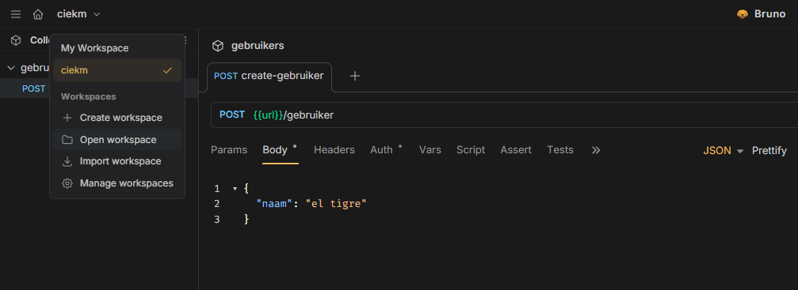

# Ciekm
Dit project bestaat uit:
- Frontend (Angular 21)
- Backend (Nestjs 11)
- Database (PostgresSQL 18)
- ORM (Prisma 7)

## Project runnen
Om dit project te runnen heb je Node nodig. Als je het project voor de eerste keer gaat runnen kan je:
1. Eerst in de root `npm i` uitvoeren
1. Dan `npm run install:ciekm` uitvoeren
1. Dan `npm run dev:ciekm` uitvoeren
1. Dan `docker network create -d bridge app_default` uitvoeren
1. Dan `npm run setup-database` uitvoeren

Dan heb je lokaal je frontend + backend + database draaien

## Backend aanroepen via Bruno
Voor het direct aanroepen van de backend kan [Bruno](https://www.usebruno.com/) gebruikt worden.
Eenmaal geopend kan je een workspace toevoegen, die zit in deze repository.
